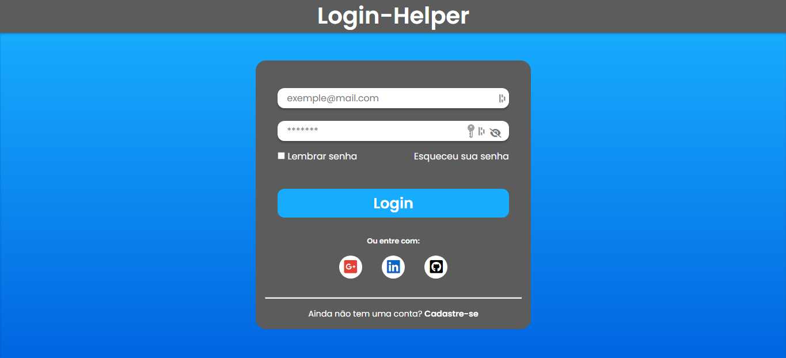

<h1 align="center"> Login Helper </h1>

Repositório criado para desenvolvimento de uma página que simula uma tela de login. O foco do projeto é a estilização. 

  <a href="#technologies">Technologies</a>&nbsp;&nbsp;&nbsp;|&nbsp;&nbsp;&nbsp;
  <a href="#project">Project</a>

 

  

## 🚀 Technologies

Esse projeto foi desenvolvido com as seguintes tecnologias:

- HTML e CSS
- JavaScript
- Git e Github

## 💻 Project

- [Visite o projeto online](https://loginhelper-raulrodmo.netlify.app/)

---

Made with 💜 by raulrodmo

